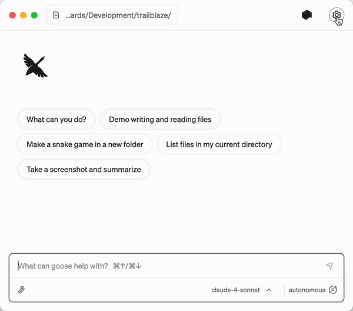
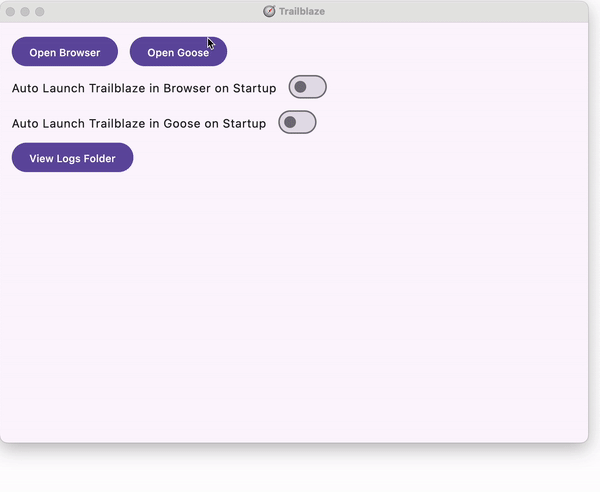

Below are the instructions for using the Trailblaze MCP server with [Goose](https://github.com/block/goose).  

Note: Trailblaze can work with any MCP client, we've just optimized for Goose. 

## 1. Download and Install the Goose Desktop App and Configure
- Download the Goose Desktop app to run Trailblaze. [Installation Guide](https://block.github.io/goose/docs/getting-started/installation/) to set it up.
- Configure your LLM API Keys to use Goose [LLM Provider Configuration](https://block.github.io/goose/docs/getting-started/providers).

## 2. Run Trailblaze

This will start the Trailblaze server and web UI.

```shell
./trailblaze
```


## 3. Install the Goose Trailblaze Extension

Now that you have the server running, you can install the Trailblaze extension in Goose.  You should only have to do this configuration once.

Squid Automated 50%, how?
- pytest based framework on Test Rack
- Apps are a blind spot.  No coverage.  Every 2 weeks, faster than squid.
- No Automation for Android Apps.
- Slow Execution Time

Challenges
- Haven't seen a demo of what Rodion and Mike are building.
- Food and Beverage Apps - iOS or Squid Device

Add a new Goose Extension with:

- Name: `Trailblaze`
- Type: `SSE`
- URL: `http://localhost:52525/sse`



## 4. Start `Trailblaze` with `Goose`

#### Within the Goose Desktop app, click `Open Goose`:



## 5. Use Goose to Interact with Trailblaze


NOTE: The only available device type is `Android` in open source, and it will run on the device itself.
