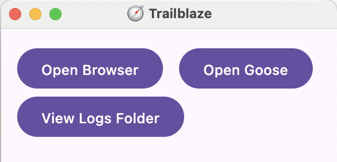
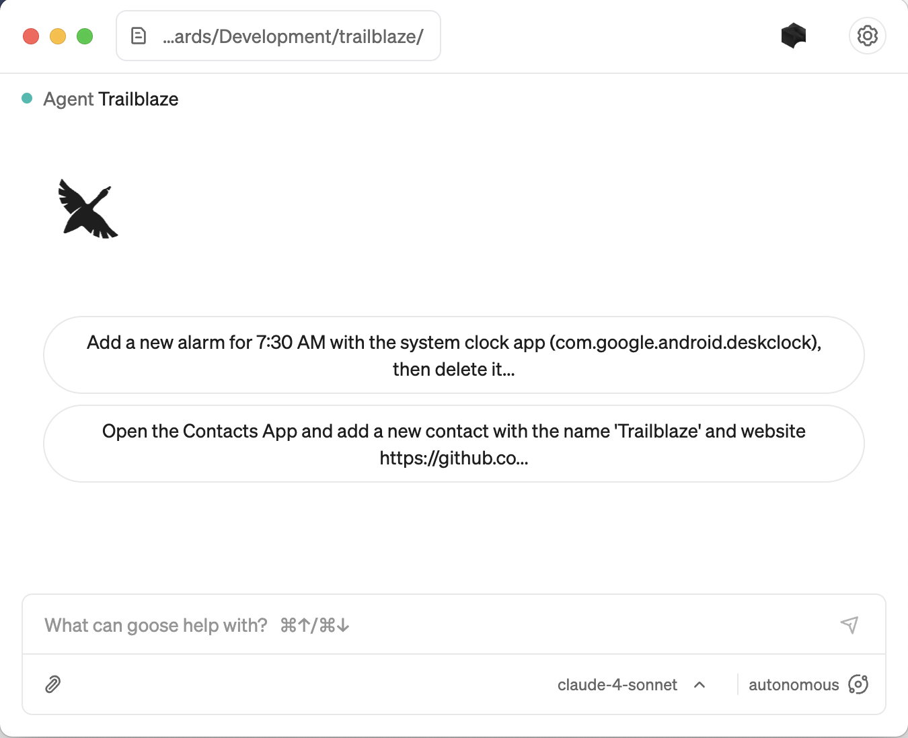

Below are the instructions for using the Trailblaze MCP server with Goose.  Trailblaze can work with any MCP server, but 

## 1. Download and Install the Goose Desktop App and Configure
- Download the Goose Desktop app to run Trailblaze. [Installation Guide](https://block.github.io/goose/docs/getting-started/installation/) to set it up.
- Configure your LLM API Keys to use Goose [LLM Provider Configuration](https://block.github.io/goose/docs/getting-started/providers).

## 2. Run Trailblaze

This will start the Trailblaze server and web UI.

```shell
./trailblaze
```

## 3. Install the Trailblaze Extension

Now that you have the server running, you can install the Trailblaze extension in Goose.  You should only have to do this configuration once.

Add a new Goose Extension with:

- Name: `Trailblaze`
- Type: `SSE`
- URL: `http://localhost:52525/sse`


## 4. Start `Trailblaze` with `Goose`

#### Within the Web UI at http://localhost:52525/, click:


...or...

#### Within the Goose Desktop app, click `Open Goose`:



## 5. Use Goose to Interact with Trailblaze


This launches the Goose UI with instructions to only use Trailblaze to control the connected device.

NOTE: The only available device type is `Android` in open source and it will run on the device itself.
